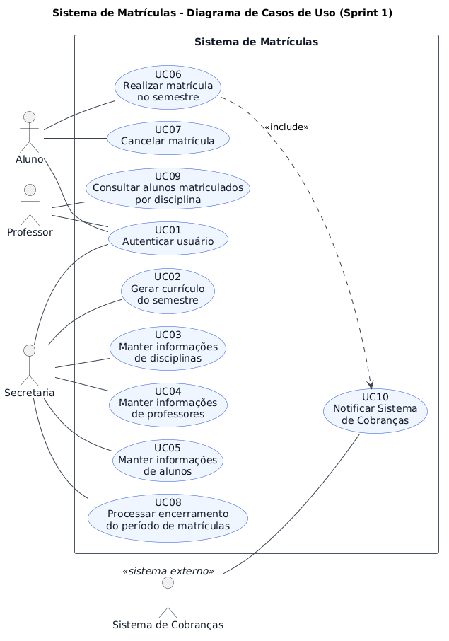
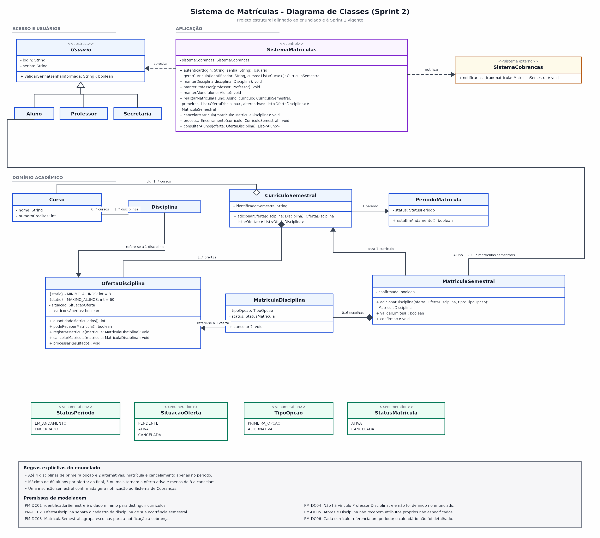

# Sistema de Matrículas

Entregas da **Sprint 1 - Modelo de Análise** e da **Sprint 2 - Projeto
Estrutural** da disciplina Projeto de Software (Laboratório 1, segundo
semestre de 2026).

## Descrição do projeto

O projeto modela um Sistema de Matrículas para uma universidade. No escopo
descrito pelo Product Owner, a Secretaria gera o currículo semestral e mantém
informações de disciplinas, professores e alunos; alunos realizam e cancelam
matrículas dentro do período permitido; professores consultam matriculados por
disciplina; e o sistema notifica um Sistema de Cobranças após a inscrição do
aluno no semestre.

## Objetivo

Entregar uma visão verificável do comportamento e da estrutura esperados do
Sistema de Matrículas por meio de requisitos, regras de negócio, atores, casos
de uso, Histórias de Usuário, modelos UML e um projeto Java alinhado ao
Diagrama de Classes.

## Sprint 1 - Modelo de Análise

Este documento contém:

- requisitos funcionais, regras de negócio, restrições e premissas;
- especificações dos casos de uso;
- Diagrama de Casos de Uso em PlantUML e sua renderização;
- Histórias de Usuário com critérios de aceitação;
- matriz de rastreabilidade `RF -> UC -> US`.

## Atores

| Ator | Natureza | Interações previstas |
|---|---|---|
| **Aluno** | Humano | Autenticar-se, realizar matrícula no semestre e cancelar matrícula anterior durante o período. |
| **Professor** | Humano | Autenticar-se e consultar os alunos matriculados em uma disciplina. |
| **Secretaria** | Humano (papel organizacional) | Autenticar-se, gerar currículo semestral, manter informações acadêmicas e solicitar o processamento do fim do período conforme PM03. |
| **Sistema de Cobranças** | Sistema externo | Receber a notificação de inscrição do Aluno no semestre. |

## Resumo dos requisitos

O modelo contém **11 requisitos funcionais (RF01-RF11)** e **7 regras de
negócio (RN01-RN07)**. O catálogo completo, as restrições, as premissas e a
matriz de rastreabilidade estão em [docs/requisitos.md](docs/requisitos.md).

Principais regras:

- cada curso tem nome, número de créditos e diversas disciplinas;
- o Aluno pode escolher até 4 disciplinas de primeira opção (obrigatórias) e até 2 alternativas (optativas), conforme PM01;
- matrícula e cancelamento só ocorrem durante o período de matrículas;
- a disciplina fica ativa com pelo menos 3 matriculados ao final do período; com menos de 3, é cancelada;
- a disciplina aceita no máximo 60 alunos e deixa de receber matrículas ao atingir esse número;
- uma inscrição bem-sucedida no semestre gera notificação ao Sistema de Cobranças;
- todo ator humano usa senha para validação de seu login.

## Casos de uso

As especificações completas estão em
[docs/casos-de-uso.md](docs/casos-de-uso.md).

| ID | Caso de uso | Ator principal |
|---|---|---|
| **UC01** | Autenticar usuário | Aluno, Professor ou Secretaria |
| **UC02** | Gerar currículo do semestre | Secretaria |
| **UC03** | Manter informações de disciplinas | Secretaria |
| **UC04** | Manter informações de professores | Secretaria |
| **UC05** | Manter informações de alunos | Secretaria |
| **UC06** | Realizar matrícula no semestre | Aluno |
| **UC07** | Cancelar matrícula | Aluno |
| **UC08** | Processar encerramento do período de matrículas | Secretaria, conforme PM03 |
| **UC09** | Consultar alunos matriculados por disciplina | Professor |
| **UC10** | Notificar Sistema de Cobranças | Acionado por UC06; Sistema de Cobranças é o receptor externo |

## Diagrama de Casos de Uso



- [Fonte PlantUML](docs/diagrama-casos-de-uso.puml)
- [Imagem PNG](docs/diagrama-casos-de-uso.png)

## Histórias de Usuário

### US01 - Autenticar usuário

> Como **Aluno, Professor ou membro da Secretaria**, quero **entrar no sistema usando meu login e minha senha**, para **acessar as funcionalidades correspondentes ao meu papel**.

**Critérios de aceitação:**

1. Dado um usuário com login e senha registrados, quando as informações fornecidas forem válidas, então o sistema deve validar o login e liberar o acesso.
2. Quando o login ou a senha forem inválidos, o sistema não deve liberar o acesso.
3. A validação deve ser aplicada aos três atores humanos: Aluno, Professor e Secretaria.

**Relacionamentos:** RF01, RN07, UC01.

### US02 - Gerar currículo do semestre

> Como **Secretaria**, quero **gerar o currículo de cada semestre**, para **registrar a composição acadêmica referente ao período letivo**.

**Critérios de aceitação:**

1. Somente a Secretaria autenticada deve executar a geração do currículo.
2. A Secretaria deve identificar o semestre ao qual o currículo pertence.
3. O currículo confirmado deve ser registrado para o semestre informado a partir dos cursos e das disciplinas.
4. Na composição considerada pelo modelo, cada curso deve possuir nome, número de créditos e diversas disciplinas.
5. Se as informações necessárias à composição não estiverem disponíveis, a geração não deve ser concluída.

**Relacionamentos:** RF02, RN01, RN07, UC02.

### US03 - Manter informações de disciplinas

> Como **Secretaria**, quero **manter as informações das disciplinas**, para **conservar esses dados disponíveis ao Sistema de Matrículas**.

**Critérios de aceitação:**

1. Somente a Secretaria autenticada deve acessar essa manutenção.
2. Uma manutenção confirmada deve ser registrada para a disciplina identificada.
3. Se a operação for interrompida antes da confirmação, o sistema não deve registrar mudanças.
4. O modelo não deve exigir atributos de disciplina que não constem no enunciado.

**Relacionamentos:** RF03, RN07, UC03.

### US04 - Manter informações de professores

> Como **Secretaria**, quero **manter as informações dos professores**, para **conservar esses dados disponíveis ao Sistema de Matrículas**.

**Critérios de aceitação:**

1. Somente a Secretaria autenticada deve acessar essa manutenção.
2. Uma manutenção confirmada deve ser registrada para o professor identificado.
3. Se a operação for interrompida antes da confirmação, o sistema não deve registrar mudanças.
4. O modelo não deve exigir atributos de professor que não constem no enunciado.

**Relacionamentos:** RF04, RN07, UC04.

### US05 - Manter informações de alunos

> Como **Secretaria**, quero **manter as informações dos alunos**, para **conservar esses dados disponíveis ao Sistema de Matrículas**.

**Critérios de aceitação:**

1. Somente a Secretaria autenticada deve acessar essa manutenção.
2. Uma manutenção confirmada deve ser registrada para o aluno identificado.
3. Se a operação for interrompida antes da confirmação, o sistema não deve registrar mudanças.
4. O modelo não deve exigir atributos de aluno que não constem no enunciado.

**Relacionamentos:** RF05, RN07, UC05.

### US06 - Realizar matrícula no semestre

> Como **Aluno**, quero **me matricular nas disciplinas de um semestre**, para **registrar minhas escolhas acadêmicas daquele semestre**.

**Critérios de aceitação:**

1. Somente o Aluno autenticado deve realizar a matrícula.
2. O sistema deve permitir a matrícula somente quando o período de matrículas estiver em andamento.
3. O sistema deve aceitar no máximo 4 disciplinas de primeira opção e no máximo 2 disciplinas alternativas por Aluno no semestre.
4. Uma seleção que exceda qualquer um desses limites não deve ser confirmada enquanto não for ajustada.
5. Uma disciplina com 59 matriculados deve poder receber a 60ª matrícula válida; depois disso, novas matrículas nela devem ser recusadas.
6. A quantidade de matriculados de uma disciplina nunca deve ultrapassar 60.
7. Uma matrícula bem-sucedida no semestre deve incluir a notificação ao Sistema de Cobranças.
8. O sistema não deve substituir automaticamente uma primeira opção por uma alternativa, pois esse comportamento não foi especificado.

**Relacionamentos:** RF06, RF08, RF10, RN02, RN03, RN05, RN06, RN07, UC06, UC10.

### US07 - Cancelar matrícula

> Como **Aluno**, quero **cancelar uma matrícula feita anteriormente**, para **retirar a inscrição que não desejo manter no semestre**.

**Critérios de aceitação:**

1. Somente o Aluno autenticado deve cancelar uma matrícula.
2. O sistema deve permitir o cancelamento somente quando o período de matrículas estiver em andamento.
3. O cancelamento deve exigir a identificação de uma matrícula anterior existente.
4. Após a confirmação, a matrícula selecionada deve ficar cancelada.
5. Se a matrícula não existir ou já estiver cancelada, o sistema não deve realizar nova alteração.
6. Não deve ser presumida uma notificação de cancelamento ao Sistema de Cobranças, pois o enunciado não a define.

**Relacionamentos:** RF07, RN03, RN07, UC07.

### US08 - Processar encerramento do período

> Como **Secretaria**, quero **processar o encerramento do período de matrículas**, para **definir quais disciplinas ocorrerão no semestre seguinte**.

**Critérios de aceitação:**

1. Somente a Secretaria autenticada deve solicitar o processamento final, conforme PM03.
2. O processamento final não deve ocorrer enquanto o período de matrículas estiver em andamento.
3. Ao final do período, toda disciplina com 3 ou mais alunos matriculados deve ficar ativa.
4. Ao final do período, toda disciplina com 0, 1 ou 2 alunos matriculados deve ser cancelada.
5. O sistema deve registrar o estado resultante de cada disciplina processada.

**Relacionamentos:** RF09, RN04, RN07, UC08.

### US09 - Consultar matriculados por disciplina

> Como **Professor**, quero **consultar os alunos matriculados em uma disciplina**, para **saber quem está inscrito nela**.

**Critérios de aceitação:**

1. Somente o Professor autenticado deve acessar a consulta.
2. Para uma disciplina registrada, a relação apresentada deve corresponder às matrículas existentes nela.
3. Se a disciplina não tiver matriculados, o sistema deve apresentar uma relação vazia.
4. A consulta não deve alterar nenhuma matrícula.
5. O modelo não deve impor vínculo entre Professor e disciplina, pois esse vínculo não foi definido no enunciado.

**Relacionamentos:** RF11, RN07, UC09.

### US10 - Receber notificação de inscrição

> Como **Sistema de Cobranças**, quero **receber a notificação da inscrição do Aluno no semestre**, para **viabilizar a cobrança das disciplinas daquele semestre**.

**Critérios de aceitação:**

1. A notificação deve ser acionada após uma matrícula bem-sucedida no semestre.
2. A notificação deve identificar o Aluno, o semestre e as disciplinas registradas necessárias à cobrança.
3. No fluxo bem-sucedido, o Sistema de Cobranças deve receber a notificação antes da conclusão de UC10.
4. O modelo não deve definir protocolo, sincronismo, política de retentativa ou compensação, pois esses detalhes não constam no enunciado.

**Relacionamentos:** RF10, RN06, UC10.

## Premissas relevantes

| ID | Premissa de modelagem |
|---|---|
| **PM01** | As quantidades 4+2 são limites máximos; o enunciado não estabelece carga mínima nem exige exatamente seis escolhas. |
| **PM02** | Alternativas são registradas como escolhas optativas, sem substituição automática. |
| **PM03** | A Secretaria solicita o processamento do encerramento para fornecer um iniciador humano ao caso de uso; agendamento automático não foi definido. |
| **PM04** | “Manter informações” não é decomposto em operações ou atributos não citados. |
| **PM05** | A estrutura interna do currículo semestral permanece não especificada. |
| **PM06** | A integração com Cobranças é abstrata e não inclui comportamento de cancelamento, protocolo ou retentativa não previstos. |
| **PM07** | A consulta do Professor não é restringida a disciplinas atribuídas, pois o enunciado não define essa atribuição. |
| **PM08** | Aluno, Professor e Secretaria são atores humanos; o Sistema de Cobranças é externo à fronteira do sistema. |
| **PM09** | Não há caso de uso para manter cursos; Curso permanece regra do domínio e contexto da geração curricular. |
| **PM10** | O período de matrículas é uma condição temporal existente; sua criação, abertura, alteração ou agenda não foi atribuída a nenhum ator. |

A lista completa e as justificativas estão em
[docs/requisitos.md](docs/requisitos.md#5-premissas-de-modelagem).

## Sprint 2 - Projeto Estrutural

A Sprint 2 acrescenta o Diagrama de Classes e o projeto Java contendo as
classes, os atributos, as associações e os stubs dos métodos modelados. O
código permanece deliberadamente sem implementação funcional: interface,
persistência e protótipo pertencem à Sprint 3.

### Diagrama de Classes



- [Fonte PlantUML](docs/diagrama-classes.puml)
- [Imagem PNG](docs/diagrama-classes.png)

As premissas necessárias ao projeto estrutural estão identificadas no próprio
diagrama como `PM-DC01` a `PM-DC06`. Em especial, não foi criado vínculo entre
Professor e Disciplina, pois essa associação não consta no enunciado.

### Projeto Java

O código-fonte está em `src/main/java` e foi organizado conforme os grupos do
Diagrama de Classes:

| Pacote | Classes e responsabilidades estruturais |
|---|---|
| `acesso` | `Usuario`, `Aluno`, `Professor` e `Secretaria`. |
| `aplicacao` | `SistemaMatriculas`, com os stubs correspondentes aos casos de uso. |
| `dominio.academico` | Currículo, curso, disciplina, oferta, período e respectivas enumerações. |
| `dominio.matricula` | Matrícula semestral, escolha de disciplina e respectivas enumerações. |
| `integracao` | Contrato `SistemaCobrancas` para o sistema externo. |

Todos os métodos concretos modelados estão declarados como stubs e lançam
`UnsupportedOperationException`. Isso evidencia que a assinatura existe sem
antecipar a implementação da Sprint 3.

> **Premissa técnica da implementação:** foi adotada a estrutura Maven com
> Java 17 apenas para organizar e validar a compilação. O enunciado exige Java,
> mas não determina versão nem ferramenta de construção.

Para compilar o projeto em um ambiente com JDK 17 e Maven:

```bash
mvn clean compile
```

## Estrutura do projeto

- `README.md`: documento principal e visão geral das Sprints 1 e 2;
- `pom.xml`: configuração Maven para Java 17;
- `src/main/java`: classes, atributos, associações e stubs do projeto estrutural;
- `docs/requisitos.md`: RF, RN, restrições, premissas e rastreabilidade;
- `docs/casos-de-uso.md`: atores e especificações completas de UC01-UC10;
- `docs/diagrama-casos-de-uso.puml`: fonte PlantUML do diagrama;
- `docs/diagrama-casos-de-uso.png`: Diagrama de Casos de Uso renderizado;
- `docs/diagrama-classes.puml`: fonte PlantUML do Diagrama de Classes;
- `docs/diagrama-classes.png`: Diagrama de Classes renderizado.

## Integrantes

- Bárbara Marcella Inácio da Silva
- Lucas Gabriel de Oliveira Franco
- Maria Clara Neri Stankunas
- Yago Garzon Chaves
